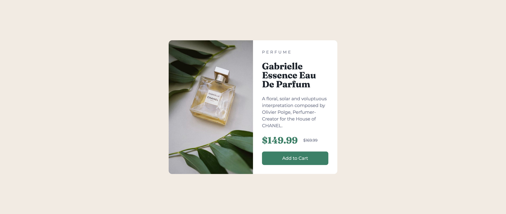

# Frontend Mentor - Product preview card component solution

This is a solution to the [Product preview card component challenge on Frontend Mentor](https://www.frontendmentor.io/challenges/product-preview-card-component-GO7UmttRfa). Frontend Mentor challenges help you improve your coding skills by building realistic projects.

## Table of contents

- [Overview](#overview)
  - [The challenge](#the-challenge)
  - [Screenshot](#screenshot)
  - [Links](#links)
- [My process](#my-process)
  - [Built with](#built-with)
  - [What I learned](#what-i-learned)

**Note: Delete this note and update the table of contents based on what sections you keep.**

## Overview

### The challenge

Users should be able to:

- View the optimal layout depending on their device's screen size
- See hover and focus states for interactive elements

This was pretty difficult to make responsive without it moving frantically. I enjoyed the process though.

### Screenshot

Desktop version:



Mobile version:


### Links

- [Live Site URL](https://product-preview-card.frilly.dev)

## My process

### Built with

- [Svelte](https://svelte.dev/)
- [Tailwind CSS](https://tailwindcss.com/)

### What I learned

I learned about the `<picture>` tag in HTML. How crazy I've been using same `` tags but just use `hidden` and `block` when appropriate sizes.

```html
<picture>
  <source srcset="/perfume-desktop.jpg" media="(min-width: 640px)" />
  
</picture>
```
